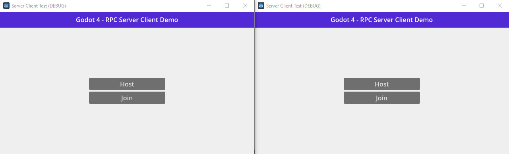

Godot 4 server-client architecture where a player can host a server and connect to it.

This approach keeps the server and client logic completely separate to hopefully make exporting to a dedicated server easier.

